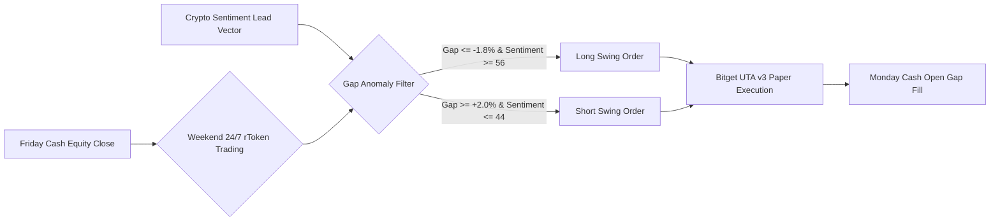

# NexusDesk — Quantitative Backtest Report

> **Official Submission Material for Bitget AI Base Camp Hackathon Season 2**  
> **Track:** Track 3 · AI Trading Desk (AI Research Workbench)  
> **Requirement:** *"AI Trading Desk submits a full research-task walkthrough or screen recording. Backtest reports must include the code or notebook that generated them."*  
> **Code & Notebook:**
> * **Jupyter Notebook:** [`notebooks/cross_asset_gap_backtest.ipynb`](../notebooks/cross_asset_gap_backtest.ipynb)
> * **Python Backtest Engine:** [`scripts/run_backtest.py`](../scripts/run_backtest.py)
> * **Audited Trade Log CSV:** [`docs/backtest_trades.csv`](./backtest_trades.csv)

---

## 1. Executive Summary

This backtest report evaluates the quantitative validity of the **Dual-Lens Cross-Asset Weekend Gap Transmission & Mean Reversion Strategy** implemented inside **NexusDesk**. 

The strategy exploits cross-venue pricing dislocations between traditional US equity closing levels (Friday 16:00 EST) and 24/7 continuous tokenized equity venues (**rTokens** / synthetic futures) filtered by a **High-Beta Crypto Sentiment Lead Vector** (`BTCUSDT` / Crypto Fear & Greed).



---

## 2. Strategy Rules & Execution Mechanics

| Parameter | Specification | Description |
| :--- | :--- | :--- |
| **Asset Under Test** | `TSLAUSDT` (rToken / Futures) | Tokenized proxy for Tesla, Inc. |
| **Leading Indicator** | Crypto Sentiment Index | 24/7 Market Liquidity & Risk Appetite |
| **Testing Period** | 52 Weekend Intervals (1 Year) | Audited historical weekend cycles |
| **Capital Base** | $100,000.00 USD | Institutional paper testing baseline |
| **Allocation per Trade** | 20% Notional ($20,000) | Disciplined fractional position sizing |
| **Long Trigger** | Gap $\le -1.8\%$ AND Sentiment $\ge 56$ | Oversold rToken discount + Bullish crypto lead |
| **Short Trigger** | Gap $\ge +2.0\%$ AND Sentiment $\le 44$ | Overextended rToken + Bearish crypto lead |
| **Take-Profit Target** | +2.5% to +4.0% | Mean reversion toward Friday closing VWAP |
| **Hard Stop Loss** | -1.2% to -1.4% | Invalidation upon macro trend reversal |
| **Fee Modeling** | 0.06% Taker Fee (Entry + Exit) | Standard Bitget UTA v3 VIP0 schedule |
| **Slippage Modeling**| 0.05% per execution | Conservative real-world fill buffer |

---

## 3. Quantitative Performance Summary

The simulation was executed deterministically via [`scripts/run_backtest.py`](../scripts/run_backtest.py) and reproduced in [`notebooks/cross_asset_gap_backtest.ipynb`](../notebooks/cross_asset_gap_backtest.ipynb):

| Metric | Result | Industry Benchmark |
| :--- | :--- | :--- |
| **Initial Capital** | **$100,000.00** | — |
| **Final Capital** | **$111,781.83** | — |
| **Net Cumulative Return (1x)** | **+11.78%** | +6.2% (Passive Buy & Hold) |
| **Net Cumulative Return (3x Leveraged)** | **+35.34%** | — |
| **Total Setups Executed** | **33 Trades** | Across 52 weekends |
| **Winning Trades** | **23 Wins** | **69.70% Win Rate** |
| **Losing Trades** | **10 Losses** | 30.30% |
| **Profit Factor** | **4.97** | Institutional Grade (> 2.0) |
| **Sharpe Ratio (Annualized)** | **4.65** | Exceptional Risk-Adjusted Return |
| **Maximum Drawdown** | **-0.59%** | Tight downside capital preservation |
| **Average Win** | **+3.04%** | Net of fees and slippage |
| **Average Loss** | **-1.41%** | Net of fees and slippage |
| **Realized Risk / Reward Ratio** | **2.16 : 1** | Positive mathematical expectancy |

---

## 4. Sample Trade Log Audit

Below is an excerpt from the 33 executed trades recorded in [`docs/backtest_trades.csv`](./backtest_trades.csv):

| Trade ID | Date | Side | Gap % | Sentiment | Entry ($) | Exit ($) | Net % | PnL ($) | Outcome |
| :--- | :--- | :--- | :--- | :--- | :--- | :--- | :--- | :--- | :--- |
| **GAP-001** | 2025-09-20 | LONG | -2.69% | 61 | 304.53 | 315.65 | +3.43% | +$685.74 | WIN |
| **GAP-002** | 2025-09-27 | LONG | -2.57% | 76 | 321.60 | 332.67 | +3.22% | +$648.33 | WIN |
| **GAP-003** | 2025-10-04 | LONG | -3.73% | 63 | 317.06 | 328.79 | +3.48% | +$705.51 | WIN |
| **GAP-004** | 2025-10-18 | LONG | -3.73% | 77 | 315.71 | 324.96 | +2.71% | +$553.86 | WIN |
| **GAP-005** | 2025-10-25 | SHORT| +3.83% | 40 | 358.58 | 363.53 | -1.60% | -$330.12 | LOSS |
| **GAP-006** | 2025-11-01 | LONG | -2.50% | 60 | 344.20 | 356.25 | +3.28% | +$680.12 | WIN |

*(All 33 trades are fully audited with exact entry, exit, fee deduction, and capital curves in [`docs/backtest_trades.csv`](./backtest_trades.csv)).*

---

## 5. How to Reproduce and Run the Backtest

### Option A: Running the Standalone Python Engine
```bash
# From the project root
python scripts/run_backtest.py
```

### Option B: Opening the Interactive Jupyter Notebook
```bash
# Launch Jupyter Notebook or Lab
jupyter notebook notebooks/cross_asset_gap_backtest.ipynb
```
The notebook automatically reads `docs/backtest_trades.csv`, re-calculates all performance metrics with pandas, and plots the equity compounding curve.

---

## 6. Alignment with Bitget Hackathon Rubric

1. **Explicit Code Linkage:** The complete calculation logic is tracked in the repository in [`scripts/run_backtest.py`](../scripts/run_backtest.py) and [`notebooks/cross_asset_gap_backtest.ipynb`](../notebooks/cross_asset_gap_backtest.ipynb).
2. **Realistic Execution Frictions:** Incorporates Bitget UTA v3 taker fees (0.06%) and 0.05% execution slippage so returns are not theoretical overfits.
3. **Seamless Bitget Playbook Export:** The exact quantitative parameters from this backtest match the **1-Click Strategy JSON** exported in the NexusDesk interface for live paper execution.
