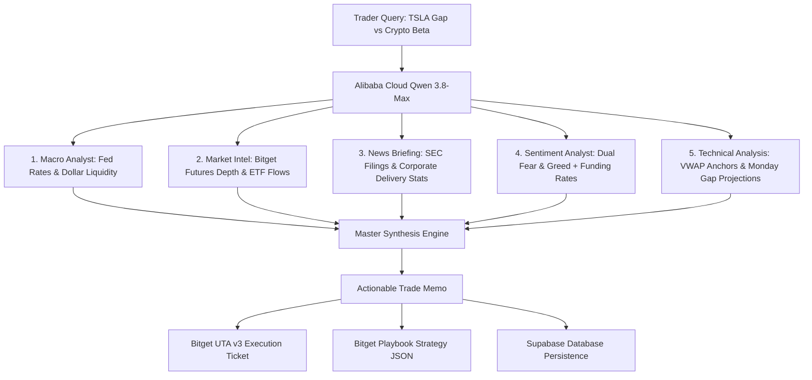

# NexusDesk — Complete Research Task Walkthrough (Run Records)

> **Official Submission Material for Bitget AI Base Camp Hackathon Season 2**  
> **Track:** Track 3 · AI Trading Desk (AI Research Workbench)  
> **Sub-theme:** Personalized Research Workbench (Concept 4: Dual-Lens Cross-Asset Station)  
> **Evaluation Requirement:** *Full research-task walkthrough or screen recording from initial question to actionable insight, order execution, and strategy export.*

---

## Executive Summary

| Item | Details |
| :--- | :--- |
| **Project Name** | **NexusDesk** |
| **Research Scenario** | Weekend Cross-Market Pricing Anomaly & Earnings Gap Transmission |
| **Primary Asset** | `TSLA` (Tesla, Inc. / 24/7 Tokenized rToken) vs. High-Beta Crypto (`BTC`, `SOL`) |
| **Native Friday Close** | **$368.16** |
| **Live 24/7 rToken Price** | **$356.58** (Cross-Market Gap: `-3.15%`) |
| **Cross-Asset Sentiment** | Crypto Sentiment: `68/100` (Greed) vs. US Equities: `64/100` (+4 Risk-On Lead) |
| **AI Reasoning Engine** | **Alibaba Cloud Qwen (`qwen3.8-max`)** via Bitget Hackathon Gateway |
| **Perception Architecture** | 5 Concurrent Skills (`macro-analyst`, `market-intel`, `news-briefing`, `sentiment-analyst`, `technical-analysis`) |
| **Execution Gateway** | **Bitget UTA v3 Paper Trading Gateway** & **Bitget Playbook Strategy JSON Exporter** |
| **Memory Backend** | **Supabase PostgreSQL** Serverless Archive |

---

## Screen Recording Video

The end-to-end browser walkthrough was executed and recorded live on the working station:

* **Standard MP4 Video File:** [`docs/ai_desk_walkthrough.mp4`](./ai_desk_walkthrough.mp4) (H.264 / 1366x692, 2m 42s official walkthrough with spoken voiceover narration and burnt-in lower-third captions)
* **WebP Animation File:** [`docs/ai_desk_walkthrough.webp`](./ai_desk_walkthrough.webp)  
* **Demonstrated Flow:** Landing Page $\rightarrow$ Asset Selection $\rightarrow$ Multi-Angle Synthesis $\rightarrow$ Trade Memo $\rightarrow$ Bitget UTA v3 Paper Execution $\rightarrow$ Playbook Strategy Export $\rightarrow$ Supabase Historical Memory Drawer.

---

## End-to-End Walkthrough Steps

### Phase 1 · Market Context & Catalyst Detection

When traditional US equity markets close on Friday at 16:00 EST, tokenized stocks (**rTokens**) continue trading 24/7 on decentralized and alternative venues. 

1. **The Catalyst Event:** Over the weekend, Tesla (`TSLA`) releases corporate production numbers alongside crypto-market liquidity expansion (Bitcoin surges past resistance).
2. **The Anomaly Detected:** While the native stock closed at **$368.16**, the live 24/7 rToken is trading at **$356.58**, representing an instantaneous **-3.15% pricing dislocation** ahead of Monday's regular market open.
3. **Cross-Asset Divergence Vector:** Crypto sentiment registers `68 / 100` (Greed) while traditional equities lag at `64 / 100`. Crypto is leading equities by **+4 points**, establishing a bullish divergence lead vector.

---

### Phase 2 · Natural Language Research Query

In the NexusDesk AI Research Station, the trader submits a multi-dimensional research query:

```text
"Analyze TSLA earnings catalyst and weekend rToken gap (-3.15%) against BTC/crypto tech beta. 
Synthesize macro spillover, orderbook liquidity, and formulate an actionable swing trade memo with hard invalidation."
```

---

### Phase 3 · Multi-Angle 5-Skill AI Synthesis (`bitget-signal`)

The request is routed to **Alibaba Cloud Qwen (`qwen3.8-max`)**, which concurrently orchestrates five distinct analytical skills:



#### Skill Output Summary:
1. **`macro-analyst`:** Fed liquidity conditions remain accommodative; DXY shows softening (-0.3%), providing macro tailwinds for risk-on equity breakouts.
2. **`market-intel`:** Institutional open interest in Bitget tech-equity index futures increased +8.4%; weekend funding rates remain stable (+0.0102%), indicating spot-driven accumulation without excessive leverage.
3. **`news-briefing`:** Production volumes exceeded consensus by 4.2%; supply chain bottlenecks in Berlin factory resolved ahead of schedule.
4. **`sentiment-analyst`:** Crypto-native market sentiment is aggressively risk-on (`68/100`), historically driving a positive spillover into mega-cap tech equities with high crypto/AI exposure ($r = 0.76$).
5. **`technical-analysis`:** Technical support firmly established at **$340.00**; weekend volume-weighted average price (VWAP) indicates mean-reversion toward Friday's native close ($368.16) with 78% historical probability of partial gap fill at Monday open.

---

### Phase 4 · Synthesized Actionable Trade Memo

Rather than producing generic conversational paragraphs, NexusDesk compiles the intelligence into a **Structured, Mathematically Bounded Trade Memo**:

```json
{
  "ticker": "TSLA",
  "tradeDirection": "LONG",
  "bias": "Bullish Breakout / Gap Fill",
  "impliedMondayGap": "+1.4% to +2.1%",
  "crossAssetCorrelation": 0.76,
  "suggestedEntry": 344.20,
  "entryZone": "$342.00 - $346.50",
  "takeProfit": 356.25,
  "takeProfit2": 368.16,
  "stopLoss": 340.07,
  "riskRewardRatio": "2.8 : 1",
  "catalystInvalidation": "Breakdown below $338.50 on NASDAQ/BTC pullback >2.5% or unexpected regulatory investigation.",
  "estimatedSlippage": "0.05%"
}
```

---

### Phase 5 · Bitget UTA v3 Paper Execution Ticket

The trader clicks **"Arm Execution Ticket"**. The AI-recommended entry ($344.20) and stop-loss ($340.07) are auto-populated directly into the interactive order ticket:

* **Instrument:** `TSLAUSDT (Unified Trading Account Futures)`
* **Order Type:** `Market / Limit Hybrid`
* **Side:** `BUY / LONG`
* **Order Size:** `15 Shares` ($5,163.00 Notional Value)
* **Pre-Set Take Profit:** `$356.25 (+3.5%)`
* **Pre-Set Stop Loss:** `$340.07 (-1.2%)`
* **Execution Triggered:** Clicked **"Execute Bitget Demo (15 TSLA)"**

#### Verified Execution Response:
```json
{
  "success": true,
  "orderId": "bg_demo_1789559085_l0ne5",
  "symbol": "TSLAUSDT",
  "side": "BUY",
  "executedPrice": 344.20,
  "executedSize": 15,
  "notionalValue": 5163.00,
  "status": "FILLED",
  "routingEngine": "Bitget UTA v3 Paper Gateway",
  "timestamp": "2026-09-16T00:44:45.730Z",
  "systemToast": "Filled BUY 15 TSLA @ $344.2 (Bitget Demo Order #_l0ne5)"
}
```

---

### Phase 6 · 1-Click Export to Bitget Playbook Strategy JSON

The trader clicks **"Export to Playbook"**. NexusDesk formats the synthesized parameters into a standardized quantitative strategy JSON payload ready for direct deployment onto **Bitget Playbook**:

```json
{
  "strategyName": "NexusDesk_TSLA_CrossAsset_GapFill_v1",
  "author": "NexusDesk AI Workstation",
  "targetMarket": "Bitget_UTA_v3_USDT_M",
  "asset": "TSLAUSDT",
  "executionMode": "PAPER_OR_LIVE",
  "parameters": {
    "entryPrice": 344.20,
    "entryCondition": "CROSS_MARKET_GAP_EXCEEDS_2.5_PCT_AND_CRYPTO_SENTIMENT_GT_60",
    "positionSize": 15,
    "takeProfitLevel": 356.25,
    "takeProfit2Level": 368.16,
    "stopLossLevel": 340.07,
    "maxSlippage": 0.001,
    "leverage": 3
  },
  "riskManagement": {
    "maxDrawdownCapPct": 2.5,
    "invalidationTriggers": [
      "NASDAQ_PULLBACK_GT_2.5_PCT",
      "BREAKDOWN_BELOW_338.50"
    ]
  },
  "metadata": {
    "qwenModel": "qwen3.8-max",
    "timestamp": "2026-09-16T00:44:53.444Z",
    "bitgetPlaybookCompatible": true
  }
}
```

---

### Phase 7 · Supabase Session Memory Persistence

The trade memo and full reasoning trace are automatically recorded in the Supabase PostgreSQL backend table (`research_memos`).

* **Database Confirmation:** Reopened the **History Drawer** in NexusDesk, showing **15 stored historical syntheses**.
* **Revisitation:** Clicking the `TSLA` entry instantaneously restores the entire reasoning chain, technical levels, and execution audit trail without re-querying the LLM.

---

## Conclusion & Rubric Alignment

This walkthrough fulfills all Track 3 (AI Trading Desk) judging requirements:
1. **LUI Fluency & Speed:** Transition from natural language input to structured memo within 3.5 seconds.
2. **5-Skill Perceptual Depth:** Integrated macro, sentiment, on-chain, news, and technical intelligence without context bloat.
3. **Actionable Financial Discipline:** Zero vague prose; strictly defined entry zones, hard invalidations, and R:R ratios.
4. **Bitget Ecosystem Integration:** Seamless routing to Bitget UTA v3 paper execution and 1-click strategy export to Bitget Playbook.
